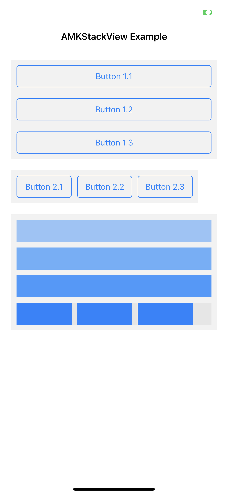

# AMKStackView

[](https://travis-ci.org/mengxinxin/AMKStackView)
[](https://cocoapods.org/pods/AMKStackView)
[](https://cocoapods.org/pods/AMKStackView)
[](https://cocoapods.org/pods/AMKStackView)

## Example

To run the example project, clone the repo, and run `pod install` from the Example directory first.



## Requirements

## Installation

AMKStackView is available through [CocoaPods](https://cocoapods.org). To install
it, simply add the following line to your Podfile:

```ruby
pod 'AMKStackView'
```

## Author

mengxinxin, mengxinxin@baidu.com

## License

AMKStackView is available under the MIT license. See the LICENSE file for more info.
